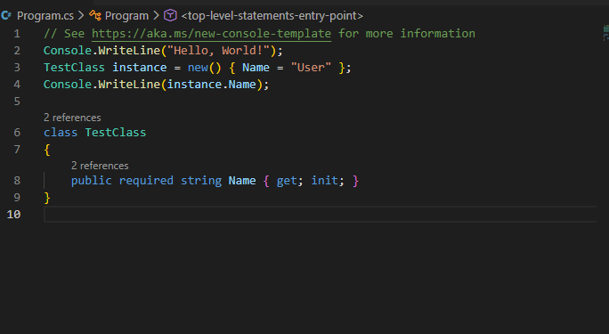
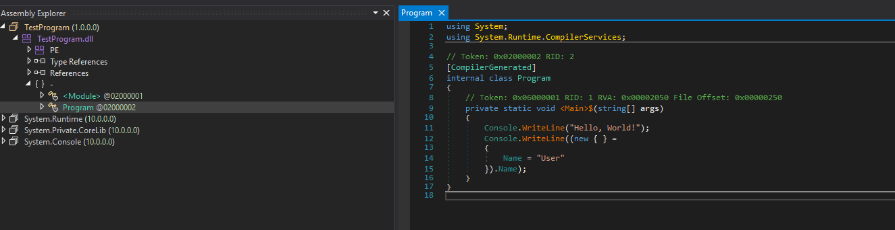

# DotnetTypeHider

Hides classes from some decompilers by setting CompilerGenerate flag and changing name to resemble an anonymous type.
Heavily inspired by <https://github.com/Washi1337/AwaitFuscator>

